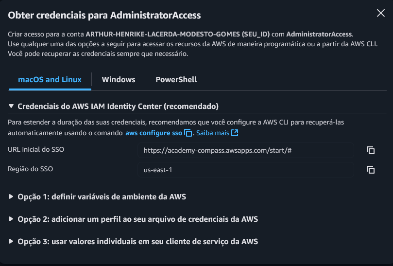

# WordPress em Alta Disponibilidade na AWS com Terraform

Este projeto implanta uma arquitetura de alta disponibilidade para o WordPress na AWS, utilizando Terraform para provisionar a infraestrutura como código. A arquitetura é projetada para ser escalável, resiliente e segura, seguindo as melhores práticas da AWS.

## Arquitetura

A arquitetura consiste nos seguintes componentes:

* **VPC Personalizada:** Uma Virtual Private Cloud (VPC) isolada para hospedar todos os recursos.
* **Sub-redes Públicas e Privadas:**
    * **2 Sub-redes Públicas:** Para o Application Load Balancer (ALB). 
    * **2 Sub-redes Privadas:** Para as instâncias EC2 e o banco de dados RDS, garantindo que não sejam diretamente acessíveis pela internet. 
* **Application Load Balancer (ALB):** Distribui o tráfego de entrada entre as instâncias WordPress em diferentes zonas de disponibilidade para garantir alta disponibilidade e escalabilidade. 
* **Auto Scaling Group (ASG):** Gerencia um grupo de instâncias EC2, escalando automaticamente com base na utilização da CPU para lidar com picos de tráfego. 
* **Amazon RDS:** Um banco de dados MySQL gerenciado para armazenar os dados do WordPress. Ele está localizado em uma sub-rede privada para maior segurança. 
* **Amazon EFS:** Um sistema de arquivos elástico e compartilhado para armazenar o conteúdo do WordPress (uploads, temas, plugins), garantindo que todos os servidores web tenham uma visão consistente dos arquivos.
* **NAT Gateway:** Permite que as instâncias nas sub-redes privadas acessem a internet para atualizações de software, sem expô-las a conexões de entrada. 
* **Internet Gateway:** Fornece acesso à internet para os recursos nas sub-redes públicas. 

## Pré-requisitos

* [Terraform](https://www.terraform.io/downloads.html) (~> 5.0)
* [AWS CLI](https://aws.amazon.com/cli/)
* Credenciais da AWS configuradas com um perfil de SSO.

## Configuração
### 1. Autenticação com AWS SSO

Para executar este projeto, você precisará de credenciais de acesso à AWS. A forma recomendada é através do AWS IAM Identity Center (SSO).

1.  Acesse o **Portal de Acesso da AWS** e localize sua conta. Clique em **"Chaves de acesso"** ao lado do perfil que deseja usar (ex: `AdministratorAccess`).
    

2.  Na tela seguinte, você verá as opções para obter as credenciais. A maneira recomendada é configurar o seu perfil diretamente na AWS CLI.
    

3.  Abra seu terminal e execute o comando abaixo:
    ```bash
    aws configure sso
    ```
4.  O terminal solicitará a **SSO start URL** e a **SSO Region**. Copie e cole os valores exibidos na sua tela de credenciais. O processo irá abrir uma janela no seu navegador para autorização.
5.  Quando solicitado um **profile name**, você pode dar um nome de sua preferência (ex: `arthur`). Este será o nome do perfil que usaremos no próximo passo.

### Efetuando Login com SSO

O token de acesso do SSO tem uma duração limitada. Caso ele expire, você precisará fazer o login novamente para autenticar sua sessão no terminal. Execute o comando abaixo, substituindo `SEU_PERFIL` pelo nome que você configurou.

```bash
aws sso login --profile SEU_PERFIL
```

### 2. Configurar Variáveis de Ambiente

1.  **Clonar o repositório:**
    ```bash
    git clone https://github.com/ArthurGomes11/DesafioPBWordpress.git
    cd DesafioPBWordpress
    ```

2.  **Configurar o arquivo `.env`:**
    Copie o arquivo de exemplo `.envexample` para um novo arquivo chamado `.env`.
    ```bash
    cp .envexample .env
    ```
    Edite o arquivo `.env` com suas informações.
    ```bash
    # Substitua com o usuário do banco de dados
    export TF_VAR_db_user="SEU_USUARIO"

    # Substitua com a senha do banco de dados
    export TF_VAR_db_password="SUA_SENHA"

    # Substitua com o nome do perfil SSO que você configurou no passo anterior
    export TF_VAR_aws_profile="SEU_PERFIL"
    ```

3.  **Carregar as variáveis de ambiente:**
    Para que o Terraform possa usar essas variáveis, você precisa exportá-las para a sua sessão do terminal. Execute o comando `source` sempre que abrir um novo terminal para trabalhar no projeto.
    ```bash
    source .env
    ```

## Como Implantar

1.  **Inicialize o Terraform:**
    ```bash
    terraform init
    ```

2.  **Planeje a implantação:**
    ```bash
    terraform plan
    ```

3.  **Aplique a configuração:**
    ```bash
    terraform apply
    ```
    Digite `yes` quando solicitado para confirmar a criação dos recursos.
    
    ```bash
    terraform apply --auto-approve
    ```
    Pode ser usado o terraform com auto approve tirando a necessidade de digitar yes.
## Acessando o WordPress

Após a conclusão da implantação, o Terraform exibirá o DNS do Application Load Balancer na saída.
```bash
Outputs:

alb_dns_name = "wordpress-alb-dev-xxxxxxxxxx.us-east-1.elb.amazonaws.com"